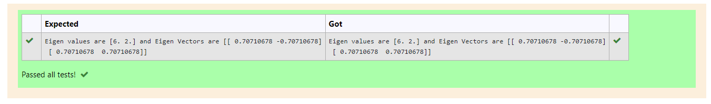

# EIGENVALUES-AND-EIGENVECTORS
## Aim:
To write a python program to find the Eigenvalues and Eigen Vectors
## Equipment’s required:
1. 	Hardware – PCs
2. 	Anaconda – Python 3.7 Installation / Moodle-Code Runner
## Algorithm:
### Step1 : 
Get the matrix from the user.
### Step 2: 
Using the np.linalg.eig(),  we get two results (first is eigenvalue and second is eigenvector) of the given matrix.
### Step 3: 
Print the two results (Eigen values and Eigen vectors).
### Step 4: 
End of the program.

## Program:
~~~
import numpy as np
a=np.array([[4,2],[2,4]])
vals,vecs=np.linalg.eig(a)
print("Eigen values are",vals,"and Eigen Vectors are",vecs)
~~~

## Output:

## Result:
Thus the Eigenvalue and Eigenvector is successfully solved using python program
